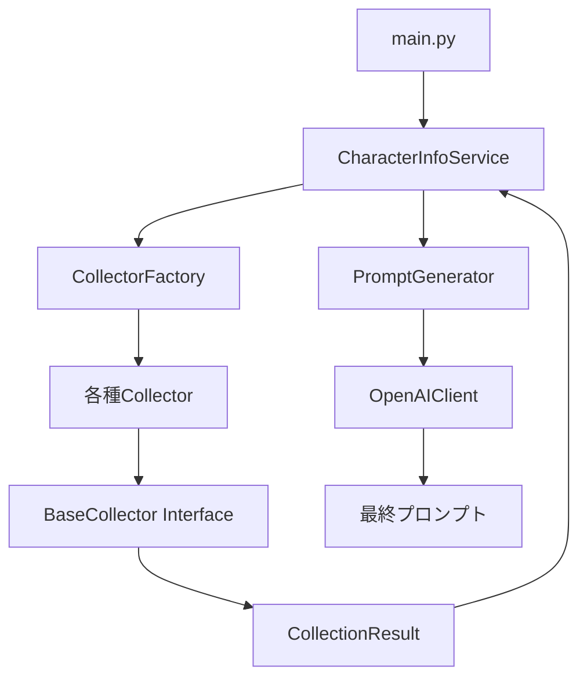

# キャラクター口調設定プロンプト自動生成プログラム - 技術仕様書

## 🏗️ アーキテクチャ概要

本プログラムは、リファクタリングにより**サービス層アーキテクチャ**と**ファクトリーパターン**を採用した、保守性と拡張性に優れた設計となっています。

### 設計思想

1. **情報収集の自動化** - Wikipedia、Web検索、YouTube動画から包括的にデータを収集
2. **ChatGPT APIへの委譲** - 収集した生データをChatGPTが整理・構造化
3. **極端な誇張表現** - キャラクター性を通常の3倍の強度で表現
4. **完全中立性** - 特定キャラクター向けの最適化は一切なし
5. **安定性重視** - レート制限とエラー耐性を最優先

## 🔧 技術スタック（リファクタリング後）

### コアアーキテクチャ
- **Python 3.8+** - 型ヒント完全対応
- **Dataclass設定管理** - 型安全な設定システム
- **サービス層パターン** - CharacterInfoServiceによる統括管理
- **ファクトリーパターン** - CollectorFactoryによる柔軟な生成
- **統一インターフェース** - BaseCollectorによる一貫したAPI

### 外部依存関係
- **OpenAI API (gpt-4o)** - プロンプト生成エンジン
- **BeautifulSoup4** - HTML解析・スクレイピング
- **requests** - HTTP通信（共通HTTPクライアント）
- **wikipedia** - Wikipedia API クライアント
- **googlesearch-python** - Google検索（フォールバック用）
- **youtube-transcript-api** - YouTube字幕取得

### 新規追加ユーティリティ
- **timing.py** - 時間計測とパフォーマンス分析
- **api_client.py** - OpenAI API専用クライアント
- **text_processor.py** - テキスト処理・パターン抽出
- **http_client.py** - 共通HTTP通信基盤

## 📐 システム設計

### レイヤー構造

```
┌─────────────────────────────────────┐
│           main.py (CLI層)           │
├─────────────────────────────────────┤
│      CharacterInfoService          │  ← サービス層
│         (ビジネスロジック)            │
├─────────────────────────────────────┤
│     CollectorFactory               │  ← ファクトリー層
│      (オブジェクト生成)               │
├─────────────────────────────────────┤
│  BaseCollector / SearchEngineCollector │ ← インターフェース層
├─────────────────────────────────────┤
│ WikipediaCollector | GoogleCollector │ ← 実装層
│ BingCollector | ChatGPTCollector     │
│ YouTubeCollector | DuckDuckGoCollector │
├─────────────────────────────────────┤
│        Utils & Common Services      │  ← 共通サービス層
│ api_client | text_processor | timing │
└─────────────────────────────────────┘
```

### データフロー



## 🛠️ 実装詳細

### 設定管理システム（config.py）

```python
@dataclass
class APIConfig:
    """API関連設定"""
    openai_model: str = "gpt-4o"
    openai_max_tokens: int = 4000
    openai_temperature: float = 0.7
    google_api_key: str = ""
    google_cx: str = ""
    
@dataclass
class SearchConfig:
    """検索関連設定"""
    google_delay: float = 6.0
    google_results: int = 15
    youtube_max_urls: int = 20
    
@dataclass
class AppConfig:
    """アプリケーション統合設定"""
    api: APIConfig
    search: SearchConfig
    collector: CollectorConfig
    processing: ProcessingConfig
```

### サービス層（CharacterInfoService）

```python
class CharacterInfoService:
    """キャラクター情報収集を統括するサービス"""
    
    def collect_character_info(
        self,
        name: str,
        logger: Optional[ExecutionLogger] = None,
        use_youtube: bool = True,
        use_google: bool = True,
        use_duckduckgo: bool = False,
        use_bing: bool = False,
        use_chatgpt_search: bool = False
    ) -> Dict[str, Any]:
        """包括的な情報収集を実行"""
        # Wikipedia情報
        character_info["wikipedia_info"] = self._collect_wikipedia_info(name)
        
        # Web検索情報
        character_info["google_search_results"] = self._collect_web_search_info(
            name, use_google, use_duckduckgo, use_bing, use_chatgpt_search
        )
        
        # YouTube情報
        if use_youtube:
            character_info["youtube_transcripts"] = self._collect_youtube_info(
                name, use_chatgpt_search, use_bing, use_duckduckgo, use_google
            )
```

### ファクトリーパターン（CollectorFactory）

```python
class CollectorFactory:
    """コレクター生成を管理するファクトリー"""
    
    @staticmethod
    def create_search_engine_collector(
        engine_type: SearchEngineType,
        api_key: Optional[str] = None,
        **kwargs
    ) -> BaseCollector:
        """検索エンジンコレクターを動的生成"""
        if engine_type == SearchEngineType.GOOGLE:
            return GoogleCollector(
                delay=config.search.google_delay,
                google_api_key=config.api.google_api_key,
                google_cx=config.api.google_cx,
                **kwargs
            )
        elif engine_type == SearchEngineType.CHATGPT:
            return ChatGPTCollector(**kwargs)
        # ... 他の検索エンジン
    
    @staticmethod
    def determine_best_search_engine(
        use_chatgpt: bool = False,
        use_bing: bool = False,
        use_duckduckgo: bool = False,
        use_google: bool = True
    ) -> SearchEngineType:
        """最適な検索エンジンを自動判定"""
```

### 統一インターフェース（interfaces.py）

```python
@dataclass
class CollectionResult:
    """標準的な収集結果データクラス"""
    found: bool
    error: Optional[str]
    results: List[Dict[str, Any]]
    total_results: int
    query: Optional[str] = None
    source: Optional[str] = None
    duration: Optional[float] = None

class BaseCollector(ABC):
    """すべてのコレクターの基底クラス"""
    
    @abstractmethod
    def collect_info(
        self, 
        name: str, 
        logger: Optional[ExecutionLogger] = None, 
        api_key: Optional[str] = None, 
        **kwargs
    ) -> CollectionResult:
        """情報収集の抽象メソッド"""
        pass

class SearchEngineCollector(BaseCollector):
    """検索エンジン系コレクターの基底クラス"""
    
    @abstractmethod
    def search_youtube_videos(self, name: str, **kwargs) -> List[str]:
        """YouTube動画URL検索の抽象メソッド"""
        pass
```

## 🔄 実装フロー詳細

### 1. 情報収集段階

#### Wikipedia収集
```python
# WikipediaCollector (リファクタリング後)
def collect_info(self, name: str, logger=None, **kwargs) -> CollectionResult:
    search_results = wikipedia.search(name, results=5)
    page_title = self._select_best_character_option(name, search_results)
    page = wikipedia.page(page_title)
    
    result_data = {
        "title": page.title,
        "summary": page.summary[:500],
        "content": page.content[:2000],
        "url": page.url,
        "categories": page.categories[:10]
    }
    
    return CollectionResult(
        found=True,
        error=None,
        results=[result_data],
        total_results=1
    )
```

#### 検索エンジン選択ロジック
```python
def _collect_web_search_info(self, name: str, use_google: bool, ...):
    # 検索エンジンを動的決定
    engine_type = CollectorFactory.determine_best_search_engine(
        use_chatgpt=use_chatgpt_search,
        use_bing=use_bing,
        use_duckduckgo=use_duckduckgo,
        use_google=use_google
    )
    
    # ファクトリーでコレクター生成
    collector = CollectorFactory.create_search_engine_collector(
        engine_type, api_key=self.api_key
    )
    
    return collector.collect_info(name, logger=logger, api_key=self.api_key)
```

### 2. プロンプト生成段階

#### ChatGPT API統合
```python
# utils/api_client.py
class OpenAIClient:
    def chat_completion(
        self, 
        messages: List[Dict[str, str]], 
        model: Optional[str] = None,
        logger: Optional[ExecutionLogger] = None
    ) -> Dict[str, Any]:
        response = self.client.chat.completions.create(
            model=model or config.api.openai_model,
            messages=messages,
            max_tokens=config.api.openai_max_tokens,
            temperature=config.api.openai_temperature
        )
        
        # ログ記録とパフォーマンス計測
        if logger:
            logger.log_api_call(api_type, request_data, response_data, duration)
```

## 🎯 主要機能詳細

### 検索エンジン対応

| 検索エンジン | 実装クラス | 特徴 | 設定 |
|------------|------------|------|------|
| **ChatGPT知識ベース** | ChatGPTCollector | レート制限なし、構造化された回答 | `--use-chatgpt-search` |
| **Google Custom Search API** | GoogleCollector | 高精度、安定動作 | `GOOGLE_API_KEY`, `GOOGLE_CX` |
| **Google検索（標準）** | GoogleCollector | フォールバック動作 | 設定不要（リスクあり） |
| **Bing検索** | BingCollector | 安定、設定不要 | `--use-bing` |
| **DuckDuckGo検索** | DuckDuckGoCollector | プライバシー重視 | `--use-duckduckgo` |

### YouTube字幕収集システム

```python
# YouTube URL取得 → 字幕取得 → ChatGPT分析のパイプライン
def _collect_youtube_info(self, name: str, ...):
    # 1. YouTube動画URL取得（検索エンジン選択に関係なく実行）
    youtube_urls = self._get_youtube_urls(name, ...)
    
    # 2. 字幕収集
    youtube_collector = CollectorFactory.create_youtube_collector()
    youtube_info = youtube_collector.collect_info(
        youtube_urls, 
        logger=logger, 
        character_info={"name": name}, 
        api_key=self.api_key
    )
```

### エラーハンドリング階層

```python
# core/exceptions.py
class CharacterPromptError(Exception):
    """基底例外クラス"""
    def __init__(self, message: str, details: Optional[Dict[str, Any]] = None, original_error: Optional[Exception] = None):

class CollectorError(CharacterPromptError):
    """コレクター関連エラー"""

class SearchEngineError(CollectorError):
    """検索エンジンエラー"""

class RateLimitError(SearchEngineError):
    """レート制限エラー"""

class APIError(CharacterPromptError):
    """API呼び出しエラー"""
```

## 📊 パフォーマンス分析機能

### 実行ログシステム
```python
# utils/execution_logger.py
class ExecutionLogger:
    def log_step(self, step_name: str, status: str, data: Dict[str, Any], duration: float = 0):
        """実行ステップを記録"""
        
    def log_api_call(self, api_type: str, request_data: Dict[str, Any], response_data: Dict[str, Any], duration: float):
        """API呼び出しを詳細記録"""
        
    def log_performance_metric(self, metric_name: str, value: float, unit: str):
        """パフォーマンス指標を記録"""
```

### 時間計測ユーティリティ
```python
# utils/timing.py
@contextmanager
def timer():
    """コンテキストマネージャーでの時間計測"""
    timer_result = TimerResult()
    try:
        yield timer_result
    finally:
        timer_result.stop()

# 使用例
with timer() as t:
    result = collector.collect_info(name)
logger.log_performance_metric("collection_duration", t.duration, "seconds")
```

## 🔍 詳細ログ・分析機能

### ログファイル構造
```json
{
  "session_id": "20241216_143052",
  "character_name": "ドラえもん",
  "start_time": "2024-12-16T14:30:52",
  "steps": [
    {
      "step_name": "wikipedia_collection",
      "status": "success",
      "duration": 1.234,
      "data": { "found": true, "title": "ドラえもん" }
    }
  ],
  "api_calls": [
    {
      "api_type": "openai_chat_completion",
      "duration": 2.567,
      "request_data": { "model": "gpt-4o", "messages_count": 2 },
      "response_data": { "result_length": 1500 }
    }
  ],
  "performance_metrics": {
    "wikipedia_duration": 1.234,
    "total_duration": 45.678
  }
}
```

## 🎨 生成コンテンツ

### 3種類の出力形式
1. **通常版プロンプト** - キャラクター性を極限まで誇張
2. **ポリシー対応版プロンプト** - ChatGPTカスタム指示で安全使用
3. **キャラクター自己紹介** - 生成プロンプトでの実演

### 誇張表現の実装
```python
# プロンプト生成時の指示
system_prompt = """
キャラクター特徴を通常の3倍の強度で表現してください：
- 語尾や口癖を過剰なほど頻繁に使用
- 感情表現は常に大袈裟で激しく
- 「普通」「標準的」「控えめ」な表現は禁止
- キャラクター性を薄めることなく、むしろ濃厚に描写
"""
```

## 🔧 開発者向け情報

### 環境設定（開発用）

```bash
# 開発環境セットアップ
python3 -m venv venv
source venv/bin/activate
pip install -r requirements.txt

# 開発用環境変数
export OPENAI_API_KEY="your-development-key"
export GOOGLE_API_KEY="your-google-key"
export GOOGLE_CX="your-search-engine-id"

# デバッグ実行
python main.py "テストキャラ" --use-chatgpt-search --no-youtube
```

### テストとデバッグ

```python
# 単体テスト例
from core.character_info_service import CharacterInfoService

service = CharacterInfoService(api_key="test-key")
result = service.collect_character_info(
    "テスト",
    use_youtube=False,
    use_google=False,
    use_chatgpt_search=False
)
```

### 拡張ポイント

1. **新しいコレクター追加**
   ```python
   class NewSearchEngine(SearchEngineCollector):
       def collect_info(self, name: str, **kwargs) -> CollectionResult:
           # 新しい検索エンジンの実装
   ```

2. **新しいユーティリティ**
   ```python
   # utils/new_utility.py
   class NewProcessor:
       def process(self, data: Dict[str, Any]) -> Dict[str, Any]:
           # 新しい処理ロジック
   ```

## 📈 パフォーマンス指標

### 計測項目
- **Wikipedia収集時間**: 平均 1-3秒
- **Web検索時間**: 平均 10-30秒（検索エンジンにより変動）
- **YouTube字幕収集**: 平均 15-45秒
- **プロンプト生成**: 平均 5-15秒
- **総実行時間**: 平均 30-90秒

### 最適化ポイント
1. **ChatGPT検索使用**: Web検索をスキップして高速化
2. **YouTube無効化**: 字幕収集をスキップして大幅高速化
3. **Google Custom Search API**: レート制限回避で安定化

## 🔒 セキュリティ考慮事項

### API Key管理
- 環境変数での管理を推奨
- コードへの直接埋め込み禁止
- ログファイルへのAPI Key出力を防止

### レート制限対策
- 適切な待機時間設定
- リトライ機構の実装
- フォールバック検索エンジンの提供

## 🎯 制約と設計原則

### 重要な制約
1. **キャラクター最適化の禁止** - 特定キャラクター向け調整は「チート」
2. **実データ重視** - 収集データに含まれる情報のみ使用
3. **極端な誇張** - キャラクター性を濃厚に描写
4. **完全中立性** - 特定の表現様式を排除しない

### アーキテクチャ原則
1. **単一責任原則** - 各クラスは明確な責任を持つ
2. **開放閉鎖原則** - 拡張に開放、修正に閉鎖
3. **依存性逆転** - 抽象に依存、具象に依存しない
4. **インターフェース分離** - 小さく集約されたインターフェース

## 💡 今後の拡張可能性

### 計画中の機能
- 新しい検索エンジンのサポート
- 音声合成APIとの連携
- キャラクター画像生成との統合
- 多言語対応

### アーキテクチャの拡張性
- プラグイン形式でのコレクター追加
- カスタムプロンプトテンプレート
- 外部データソースとの連携
- リアルタイム情報更新機能

---

このアーキテクチャにより、保守性・拡張性・テスタビリティを大幅に向上させ、今後の機能追加や変更に柔軟に対応できる基盤が構築されています。